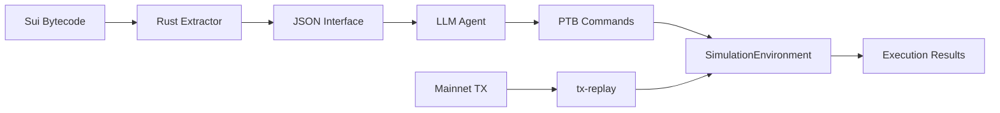

# `sui-move-interface-extractor`

**Quantifying AI's understanding of Sui Move smart contracts through bytecode extraction and type inhabitation testing.**

This project provides:
1. A **Rust CLI** for parsing Sui Move `.mv` bytecode into deterministic JSON interfaces
2. A **SimulationEnvironment** - A comprehensive Move VM sandbox for offline execution
3. A **Python benchmark harness** to evaluate LLM capability on Move type understanding
4. **Transaction replay** from Sui mainnet for validation testing



## Core Concept: SimulationEnvironment

The **SimulationEnvironment** is the central execution backend that powers all sandbox operations:

- **Deterministic PTB Execution**: Execute Programmable Transaction Blocks offline with full object tracking
- **Transaction Replay**: Fetch and replay real mainnet transactions locally
- **Self-Healing Evaluation**: Automatically recover from missing packages/objects
- **LLM Sandbox Interface**: JSON protocol for AI agent interaction
- **Zero gas, tokens, or network access** required for execution

### CLI Commands

| Command | Description |
|---------|-------------|
| `benchmark-local` | Tier A/B type inhabitation testing |
| `tx-replay` | Fetch and replay mainnet transactions |
| `ptb-eval` | Evaluate PTBs with self-healing |
| `sandbox-exec` | Interactive sandbox execution (JSON protocol) |

See [docs/ARCHITECTURE.md](docs/ARCHITECTURE.md) for how these components integrate.

## Quick Links

| Audience | Start Here |
|----------|------------|
| **New Users** | [Quick Start Guide](QUICK_START_GUIDE.md) |
| **Researchers** | [Methodology](docs/METHODOLOGY.md) |
| **Operators** | [Production Deployment](PRODUCTION_DEPLOYMENT.md) |
| **Contributors** | [Architecture](benchmark/docs/ARCHITECTURE.md) |

---

## 🔥 Primary Features

1. **Bytecode Interface Extractor (Rust)**: High-performance CLI to extract canonical JSON interfaces from compiled `.mv` modules.
2. **SimulationEnvironment**: Comprehensive Move VM sandbox with PTB execution, object tracking, and state management.
3. **Transaction Replay (`tx-replay`)**: Fetch real Sui mainnet transactions and replay them locally for validation.
4. **PTB Evaluation (`ptb-eval`)**: Self-healing evaluation that auto-recovers from missing packages/objects.
5. **LLM Sandbox (`sandbox-exec`)**: JSON-based interface for AI agents to interact with the Move VM.
6. **LLM Benchmark Harness (Python)**: Comprehensive E2E pipeline to evaluate AI understanding of Move code via autonomous transaction planning.
7. **Dockerized API (A2A)**: Production-ready Agent-to-Agent interface for running large-scale evaluations with detailed analytics.

---

## 🚀 Quick Start: Top 25 Dataset

The **Top 25 Dataset** is the recommended starting point for running meaningful benchmarks. It contains 25 curated mainnet packages that represent diverse Move patterns.

### Run the Top 25 Benchmark

```bash
# 1. Build the Rust binary
cargo build --release

# 2. Clone the corpus (one-time)
git clone --depth 1 https://github.com/MystenLabs/sui-packages.git ../sui-packages

# 3. Run with the Top 25 dataset
cd benchmark
uv run smi-inhabit \
  --corpus-root ../sui-packages/packages/mainnet_most_used \
  --dataset type_inhabitation_top25 \
  --samples 25 \
  --agent real-openai-compatible \
  --out results/top25_run.json
```

### Docker Quick Start (Recommended)

The fastest way to get started is with the Docker quickstart script:

```bash
# Run the quickstart (5 packages: 1 easy, 2 medium, 2 hard)
./scripts/docker_quickstart.sh

# Or test with mock agent (no API key needed)
./scripts/docker_quickstart.sh --mock
```

For production benchmarks:

```bash
# Run full benchmark via A2A server
./scripts/run_docker_benchmark.sh google/gemini-3-flash-preview 25 9999

# Or with specific options
./scripts/run_docker_benchmark.sh google/gemini-3-flash-preview 25 9999 \
    --dataset type_inhabitation_top25 \
    --simulation-mode dry-run
```

### Python CLI Quick Start

For direct Python usage without Docker:

```bash
cd benchmark

# Single LST package test (canonical benchmark)
export SMI_E2E_REAL_LLM=1
export OPENROUTER_API_KEY=sk-or-v1-...
uv run python scripts/e2e_one_package.py \
    --corpus-root ../sui-packages/packages/mainnet_most_used \
    --dataset single_lst \
    --model google/gemini-3-flash-preview \
    --out-dir results/lst_test
```

See [benchmark/DATASETS.md](benchmark/DATASETS.md) for all available datasets.

---

## 🛠️ CLI Commands

The Rust CLI provides four main commands for different use cases:

### `benchmark-local` - Type Inhabitation Testing

Test whether function types can be inhabited (synthesized and executed):

```bash
./target/release/sui_move_interface_extractor benchmark-local \
  --target-corpus /path/to/bytecode \
  --output results.jsonl \
  --use-ptb  # Use PTB execution via SimulationEnvironment
```

### `tx-replay` - Transaction Replay

Fetch and replay mainnet transactions locally:

```bash
# Download recent transactions to cache
./target/release/sui_move_interface_extractor tx-replay \
  --recent 100 \
  --cache-dir .tx-cache \
  --download-only

# Replay from cache with parallel execution
./target/release/sui_move_interface_extractor tx-replay \
  --cache-dir .tx-cache \
  --from-cache \
  --parallel \
  --framework-only  # Only replay framework transactions
```

### `ptb-eval` - PTB Evaluation with Self-Healing

Evaluate cached transactions with automatic error recovery:

```bash
./target/release/sui_move_interface_extractor ptb-eval \
  --cache-dir .tx-cache \
  --max-retries 3 \
  --enable-fetching \  # Fetch missing packages from mainnet
  --show-healing       # Show self-healing actions taken
```

### `sandbox-exec` - Interactive Sandbox

JSON-based interface for LLM agents:

```bash
# Interactive mode (JSON lines on stdin/stdout)
./target/release/sui_move_interface_extractor sandbox-exec --interactive

# Single request from file
echo '{"action": "list_modules"}' | \
  ./target/release/sui_move_interface_extractor sandbox-exec --input - --output -
```

See [docs/CLI_REFERENCE.md](docs/CLI_REFERENCE.md) for complete command reference.

---

## 🧪 Case Study: Liquid Staking Package

The **Liquid Staking package** (`0x059f94b85c07eb74d2847f8255d8cc0a67c9a8dcc039eabf9f8b9e23a0de2700`) is a complex Move package that serves as an excellent benchmark for LLM capabilities. It has no trivial entry points—requiring the agent to understand and chain multiple constructors.

### Why This Package?

- **Complex Type Dependencies**: Creating an LST token requires calling `liquid_staking::create_lst` with specific capability objects
- **No Simple Paths**: Unlike `coin::mint`, there's no single entry function that creates the target type
- **Real-World DeFi Logic**: Represents actual production staking infrastructure

### Run the E2E Pipeline

```bash
cd benchmark

# Test the LLM's ability to generate helper packages
export SMI_E2E_REAL_LLM=1
export OPENROUTER_API_KEY=sk-or-v1-...

uv run python scripts/e2e_one_package.py \
    --corpus-root ../sui-packages/packages/mainnet_most_used \
    --package-id 0x059f94b85c07eb74d2847f8255d8cc0a67c9a8dcc039eabf9f8b9e23a0de2700 \
    --model google/gemini-3-flash-preview \
    --out-dir results/lst_case_study
```

### What the Pipeline Does

1. **Extracts Interface**: Parses bytecode to JSON interface
2. **LLM Generates Helper**: Agent creates a Move helper package that imports the target
3. **Compiles Helper**: `sui move build` in Docker with vendored dependencies
4. **Simulates TX**: Executes in local VM to verify type inhabitation

See [specs/LIQUID_STAKING_CASE_STUDY.md](specs/LIQUID_STAKING_CASE_STUDY.md) for detailed analysis.

---

## ⚡ Local Bytecode Sandbox: Type Inhabitation Testing

The `benchmark-local` subcommand uses the **Local Bytecode Sandbox** to validate type inhabitation **without any network access**. It loads external package bytecode and executes it in an embedded Move VM.

### Usage

```bash
# Tier A only (fast, bytecode validation)
./target/release/sui_move_interface_extractor benchmark-local \
  --target-corpus /path/to/bytecode_modules \
  --output results.jsonl \
  --tier-a-only

# Full validation with VM execution (Tier A + B)
./target/release/sui_move_interface_extractor benchmark-local \
  --target-corpus /path/to/bytecode_modules \
  --output results.jsonl \
  --restricted-state
```

### Two-Tier Evaluation

| Tier | Name | What It Proves |
|------|------|----------------|
| **A** | Preflight | Types resolve, BCS serializes correctly, layouts are valid |
| **B** | Execution | Code runs in the Move VM without aborting |

### Failure Taxonomy

The key metric is **failure distribution by stage**, not a single pass rate:

| Stage | Indicates |
|-------|-----------|
| A1-A3 | Type resolution/synthesis issues |
| B1 | Constructor execution failures |
| B2 | Target function aborted (includes expected unsupported natives) |

This taxonomy helps researchers understand *where* LLM type understanding breaks down. See [docs/LOCAL_BYTECODE_SANDBOX.md](docs/LOCAL_BYTECODE_SANDBOX.md) for detailed interpretation.

### Why Local Bytecode Sandbox?

- **Deterministic**: Same bytecode + same input = same result, every time
- **Fast**: Validates 100+ modules in seconds
- **Portable**: Works in offline/air-gapped CI/CD pipelines
- **Zero Cost**: No Sui tokens, gas, or network access required
- **Real VM**: Uses actual Move VM, not simulation—type checking is genuine

See [docs/LOCAL_BYTECODE_SANDBOX.md](docs/LOCAL_BYTECODE_SANDBOX.md) for architecture details and [docs/NO_CHAIN_TYPE_INHABITATION_SPEC.md](docs/NO_CHAIN_TYPE_INHABITATION_SPEC.md) for the technical specification.

---

## 📦 Installation

### Prerequisites

- **Rust**: 1.75+ (`rustup update stable`)
- **Python**: 3.11+ with `uv` (`curl -LsSf https://astral.sh/uv/install.sh | sh`)
- **Docker**: For containerized benchmarks (optional but recommended)

### Build from Source

```bash
# Clone repository
git clone https://github.com/your-org/sui-move-interface-extractor.git
cd sui-move-interface-extractor

# Build Rust CLI
cargo build --release

# Install Python dependencies
cd benchmark
uv sync --group dev --frozen
```

### Verify Installation

```bash
# Test Rust CLI
./target/release/sui_move_interface_extractor --help

# Test Python harness
cd benchmark
uv run smi-inhabit --help
```

---

## 🐳 Docker Deployment

```bash
# Start the benchmark API
docker compose up -d smi-bench

# Verify health
curl -s http://localhost:9999/health | jq '.status'
# Expected: "ok"

# Run a benchmark
cd benchmark
uv run python3 run_real_world_test.py \
    --samples 5 \
    --models gpt-4o-mini \
    --simulation-mode dry-run
```

See [PRODUCTION_DEPLOYMENT.md](PRODUCTION_DEPLOYMENT.md) for production setup including offline mode.

---

## 📚 Documentation

### Core Guides

| Document | Description |
|----------|-------------|
| [QUICK_START_GUIDE.md](QUICK_START_GUIDE.md) | 30-second quick start with all features |
| [benchmark/GETTING_STARTED.md](benchmark/GETTING_STARTED.md) | Complete benchmark setup and usage |
| [PRODUCTION_DEPLOYMENT.md](PRODUCTION_DEPLOYMENT.md) | Production deployment with Docker |

### Technical References

| Document | Description |
|----------|-------------|
| [docs/ARCHITECTURE.md](docs/ARCHITECTURE.md) | SimulationEnvironment and system architecture |
| [docs/CLI_REFERENCE.md](docs/CLI_REFERENCE.md) | All CLI commands and flags |
| [docs/LOCAL_BYTECODE_SANDBOX.md](docs/LOCAL_BYTECODE_SANDBOX.md) | Local Bytecode Sandbox internals |
| [docs/METHODOLOGY.md](docs/METHODOLOGY.md) | Scoring rules and research methodology |
| [docs/NO_CHAIN_TYPE_INHABITATION_SPEC.md](docs/NO_CHAIN_TYPE_INHABITATION_SPEC.md) | Tier A/B validation specification |
| [benchmark/DATASETS.md](benchmark/DATASETS.md) | Dataset creation and usage |

### Architecture & Internals

| Document | Description |
|----------|-------------|
| [docs/design/local-move-vm-sandbox.md](docs/design/local-move-vm-sandbox.md) | VM sandbox design and implementation status |
| [benchmark/docs/ARCHITECTURE.md](benchmark/docs/ARCHITECTURE.md) | Python harness architecture |
| [IMPLEMENTATION_SUMMARY.md](IMPLEMENTATION_SUMMARY.md) | Implementation decisions |
| [docs/A2A_PROTOCOL.md](docs/A2A_PROTOCOL.md) | A2A protocol integration |

---

## 🧪 Running Tests

```bash
# Rust tests
cargo test

# Python tests
cd benchmark
uv run pytest tests/ -v

# Full CI checks
cargo fmt && cargo clippy && cargo test
cd benchmark && uv run pytest
```

---

## 📊 Output Example

### `benchmark-local` Output (JSONL)

```json
{
  "target_package": "0x059f94b85c07eb74...",
  "target_module": "liquid_staking",
  "target_function": "create_lst",
  "status": "tier_b_hit",
  "tier_a_details": {"validation_time_ms": 12, "bcs_roundtrip_verified": true},
  "tier_b_details": {"execution_success": true, "gas_used": 1000}
}
```

### Phase II Benchmark Output

```json
{
  "schema_version": 2,
  "aggregate": {
    "avg_hit_rate": 0.42,
    "packages_total": 25,
    "errors": 0
  },
  "packages": [...]
}
```

---

## 🤝 Contributing

See [AGENTS.md](AGENTS.md) for development guidelines and coding conventions.

```bash
# Development workflow
cargo fmt && cargo clippy
cd benchmark && uv run pytest tests/ -v
```

---

## 📄 License

MIT License - see [LICENSE](LICENSE) for details.
