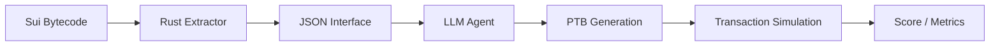

# `sui-move-interface-extractor`

**Quantifying AI's understanding of Sui Move smart contracts through bytecode extraction and autonomous transaction planning.**

This project provides a standalone Rust CLI for parsing Sui Move `.mv` modules into deterministic JSON and a Python-based benchmark harness to evaluate LLM performance on complex "Type Inhabitation" (autonomous transaction planning) challenges.



## 🚀 Getting Started

### 1. Environment Setup (3 minutes)

Ensure you have the **Rust toolchain** ([rustup.rs](https://rustup.rs)) and **uv** ([astral.sh/uv](https://astral.sh/uv)) installed.

```bash
# 1. Build the Rust binaries (Extractor & Simulator)
cargo build --release --locked

# 2. Setup the Python benchmark environment
cd benchmark
uv sync --group dev --frozen

# 3. Clone the Bytecode Corpus (Required for testing)
git clone --depth 1 https://github.com/MystenLabs/sui-packages.git ../sui-packages
```

### 2. ⚡ Fast Success Loop (The Top-25 Dataset)

Instead of running the full 1,000+ package corpus, use our curated **Top-25** dataset. It provides high-signal coverage of diverse Sui Move patterns and completes in under 5 minutes.

**Recommended Model:** Gemini 3 Flash Preview (`google/gemini-3-flash-preview`)

```bash
cd benchmark
./scripts/run_model.sh --env-file .env \
  --model google/gemini-3-flash-preview \
  --dataset type_inhabitation_top25 \
  --run-samples 5
```

---

## 📖 Documentation Map

### 🚀 Getting Started
- **[Benchmark Guide](docs/BENCHMARK_GUIDE.md)** - Comprehensive walkthrough for Phase I & II.
- **[Life of a Hit](docs/WALKTHROUGH.md)** - Step-by-step example of a successful benchmark run.
- **[CLI Reference](docs/CLI_REFERENCE.md)** - Commands for direct bytecode extraction and verification.
- **[A2A Protocol](docs/A2A_PROTOCOL.md)** - Agent-to-Agent integration and tuning guide.

### 📖 Research & Methodology
- **[Insights & Reward](docs/INSIGHTS.md)** - High-value takeaways and research value proposition.
- **[Methodology](docs/METHODOLOGY.md)** - Scoring rules, bytecode-first logic, and AgentBeats mapping.
- **[PTB Schema](docs/PTB_SCHEMA.md)** - Transaction plan format and normalization rules.
- **[Architecture](docs/ARCHITECTURE.md)** - Maintainers' map of the system internals.
- **[Contributing](docs/CONTRIBUTING.md)** - Developer standards and documentation guidelines.

### 🛠️ Reference & Ops
- **[Datasets Guide](docs/DATASETS.md)** - Creating and using curated package lists.
- **[JSON Schema](docs/SCHEMA.md)** - Exact interface and result schemas.
- **[Troubleshooting](docs/TROUBLESHOOTING.md)** - Common environment issues and fixes.

---

## Direct Usage (Rust CLI)

Emit a canonical interface JSON from a local Sui Move package:

```bash
mkdir -p out
./target/release/sui_move_interface_extractor \
  --bytecode-package-dir ../sui-packages/packages/mainnet_most_used/0x00/00...02 \
  --emit-bytecode-json out/0x2_interface.json \
  --sanity
```

## AgentBeats / Berkeley “Green Agent” (AgentX)

This repo is the official substrate for the AgentBeats-style evaluations on Sui Move bytecode. It provides:
- **Phase I (Discovery)**: Can the AI find critical data structures?
- **Phase II (Inhabitation)**: Can the AI write valid transactions to create those structures?

See `docs/AGENTBEATS.md` for the platform roadmap.

## Docker

Build the unified benchmark and Rust environment:

```bash
docker compose build
docker compose up -d --wait
```

For more commands, see `docs/RUNBOOK.md`.